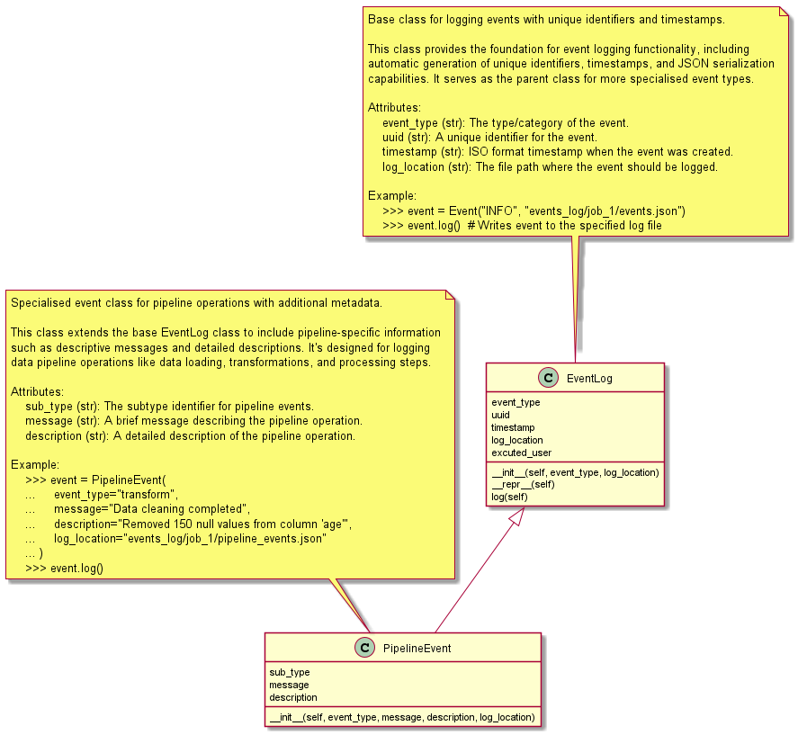
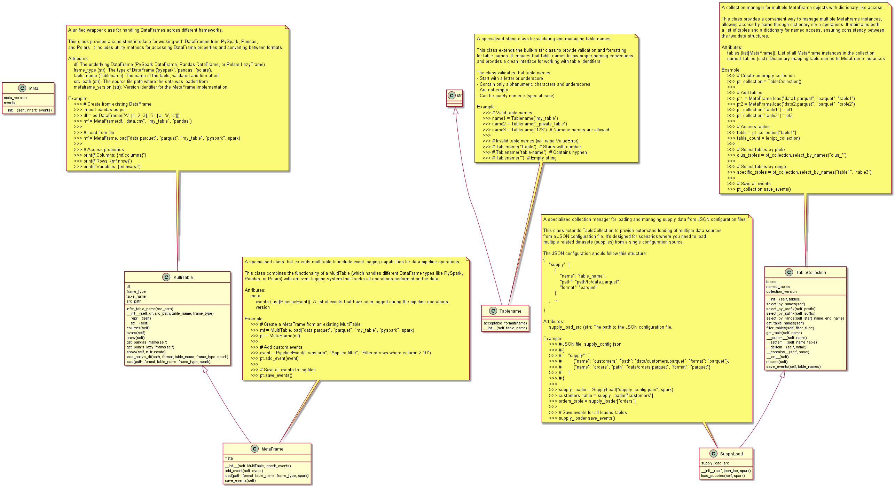
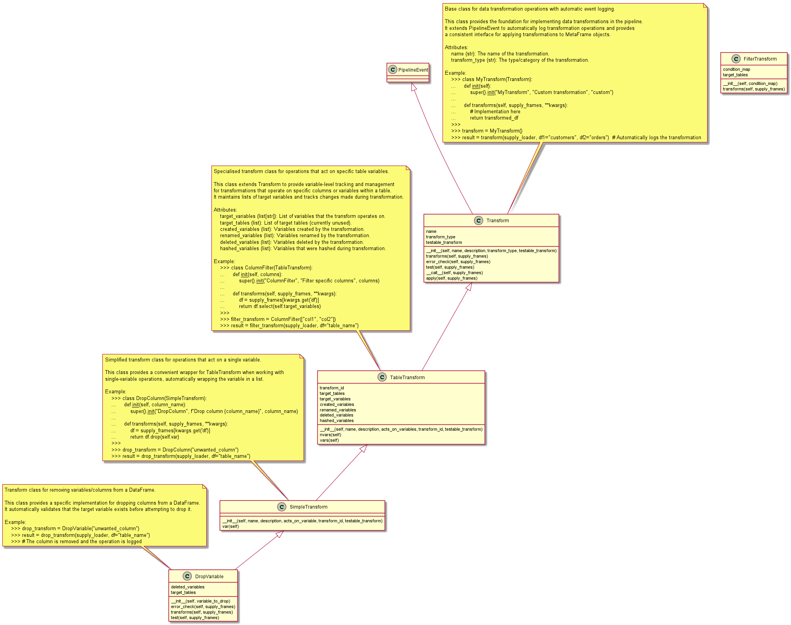

# Meta Transforms Framework - RC 3

This program provides a data transformation framework for working with tables (DataFrames) in PySpark, Pandas, or Polars. It tracks all transformations and important events in a structured, auditable way using JSON logs.

# Main Components

```
.
|-- 📁 src/
|   |-- 📁 events/
|   |   |-- 🐍 eventlog.py
|   |   `-- 🐍 pipeline_event.py
|   |-- 📁 tables/
|   |   |-- 📁 collections/
|   |   |   |-- 🐍 collection.py
|   |   |   `-- 🐍 supply_load.py
|   |   |-- 🐍 metaframe.py
|   |   |-- 📁 names/
|   |   |   |-- 🐍 headername.py
|   |   |   |-- 🐍 lists.py
|   |   |   `-- 🐍 tablename.py
|   |   `-- 🐍 multitable.py
|   `-- 📁 transforms/
|       |-- 🐍 base.py
|       `-- 🐍 lib.py
`-- 📁 templates/
    `-- 🐍 template_load_pipe.py
```

## Events

### 1. EventLog
**Purpose:** Handles event logging and saving of events during pipeline execution.

**Features:**
- Manages the logging of events generated during the data pipeline's execution.
- Provides methods to save events to a JSON file for auditing and tracking purposes.
- Supports different logging levels and destinations.



### 2. PipelineEvent
**Purpose:** Represents an event (e.g., loading a table, applying a transform).

**Features:**
- Stores detailed information about each event, including event type, message, description, timestamp, and a unique UUID.
- Provides methods to format the event information as a JSON object.
- Can be extended to represent specific types of events, such as load events or transform events.
- Includes a log_location attribute to track where the event is logged.
- Serves as a base class for all pipeline events, ensuring a consistent structure and interface.

**Example JSON output for a load event:**
```json
{
  "event_type": "load",
  "message": "Loaded table from test.csv as csv (pyspark)",
  "description": "Loaded test_table from test.csv",
  "uuid": "b2e7c8e2-7d4e-4c7e-8b8e-2f6e7c8e2d4e",
  "timestamp": "2025-08-10T12:34:56.789012",
  "log_location": "events_log/job_1/test_table_events.json"
}
```

## Tables



### 1. TableName
**Purpose:** Represents a standardised name for a table.

### 2. MultiTable
**Purpose:** Manages multiple dataframes and tables in complex data pipelines.

**Features:**
- Stores and manages different types of dataframe objects.
- Facilitates operations across multiple tables, such as applying the same transformation to all tables in the collection.
- Provides methods for accessing and manipulating tables within the collection.

### 3. Metaframe
**Purpose:** Wraps a DataFrame and tracks its metadata.

**Features:**
- Supports loading tables from CSV, Parquet, or SAS files into Spark, Pandas, or Polars DataFrames.
- Can convert between DataFrame types (Pandas, Polars, PySpark).
- Stores table metadata including source path, table name, and frame type.
- Provides utility methods for DataFrame type conversion.

**Example:**
```python
from pyspark.sql import SparkSession
from metaframe import MetaFrame

spark = SparkSession.builder.getOrCreate()
tbl = MetaFrame.load(spark=spark, path="test.csv", format="csv", table_name="test_table", frame_type="pyspark")
```

### 3. PipelineTable
**Purpose:** Extends MetaFrame to include event tracking and logging capabilities.

**Features:**
- Inherits from MetaFrame and adds event tracking functionality.
- Stores a list of `PipelineEvent` objects describing actions performed on the table.
- Can save all events to a JSON log file.
- Automatically logs load events when tables are loaded.

**Example:**
```python
from pipeline_table import PipelineTable

tbl = PipelineTable.load(spark=spark, path="test.csv", format="csv", table_name="test_table", frame_type="pyspark")
```

### 4. TableCollection
**Purpose:** A collection manager for multiple PipelineTable objects with dictionary-like access.

**Features:**
- Manages multiple PipelineTable instances in a single collection.
- Provides dictionary-style access to tables by name.
- Supports adding, removing, and checking for tables.
- Can save events for all tables in the collection at once.
- Maintains both a list of tables and a dictionary for named access.
- **NEW:** Advanced table selection by patterns, prefixes, suffixes, and ranges.
- **NEW:** Returns references to the same table objects, so modifications are reflected across collections.

**Example:**
```python
from pipeline_table import PipelineTable, PipelineTables

# Load multiple tables
test_table = PipelineTable.load(spark=spark, path="test_tables/test.csv", format="csv", table_name="test_table", frame_type="pyspark")
test2_table = PipelineTable.load(spark=spark, path="test_tables/test2.csv", format="csv", table_name="test2_table", frame_type="pyspark")
clus_table = PipelineTable.load(spark=spark, path="test_tables/clus_data.csv", format="csv", table_name="clus_data", frame_type="pyspark")

# Create collection
tables_list = [test_table, test2_table, clus_table]
pt_collection = PipelineTables(tables_list)

# Access tables by name
first_table = pt_collection["test_table"]
print(f"Collection has {pt_collection.ntables} tables")
print(f"Available tables: {list(pt_collection.named_tables.keys())}")

# NEW: Select tables by patterns
clus_tables = pt_collection.select_by_names("clus_*")  # All tables starting with "clus_"
specific_tables = pt_collection.select_by_names("test_table", "test2_table")  # Specific tables
mixed_tables = pt_collection.select_by_names("clus_*", "test_table")  # Multiple patterns

# NEW: Convenience methods
prefix_tables = pt_collection.select_by_prefix("clus_")  # Same as "clus_*"
suffix_tables = pt_collection.select_by_suffix("_data")  # All tables ending with "_data"
range_tables = pt_collection.select_by_range("test_table", "test2_table")  # Tables in lexicographic range

# NEW: Custom filtering
large_tables = pt_collection.filter_tables(lambda t: len(t.df) > 1000)  # Tables with >1000 rows

# Save events for all tables
pt_collection.save_events()
```

### 5. SupplyLoad
**Purpose:** A specialised collection manager for loading and managing supply data from JSON configuration files.

**Features:**
- Extends PipelineTables to provide automated loading of multiple data sources.
- Loads tables from a JSON configuration file.
- Designed for scenarios where you need to load multiple related datasets from a single configuration source.
- All tables are loaded as PySpark DataFrames by default.

**Example:**
```python
from supply_load import SupplyLoad

# Load multiple tables from JSON configuration
supply_frames = SupplyLoad("test_tables/payload.json", spark=spark)
print("Original columns:", supply_frames["test_table"].columns)

# Apply transformations
supply_frames = DropVariable("age")(supply_frames, df="test_table")

# Save events for all tables
supply_frames.save_events()
```

## Transforms



### 1. Transform and Subclasses
**Purpose:** Encapsulates data transformations.

**Features:**
- Each transform is a subclass of `PipelineEvent` and logs itself when applied, ensuring auditability.
- `Transform` is the abstract base class for all transformations, defining the interface for transform execution.
- `TableTransform` is a base class for transformations that operate on entire tables.
- `SimpleTransform` is a base class for transformations that operate on a single variable or column within a table.
- `DropVariable` is a concrete example, removing a specified column from a DataFrame.

**Example:**
```python
from transforms import DropVariable

tbl = DropVariable("age")(tbl)
```

## Example Workflows

### Method 1: Direct Table Loading

1. **Load a table:**
    ```python
    from pyspark.sql import SparkSession
    from pipeline_table import PipelineTable
    
    spark = SparkSession.builder.master("local").appName("TransformTest").getOrCreate()
    tbl = PipelineTable.load(spark=spark, path="test.csv", format="csv", table_name="test_table", frame_type="pyspark")
    ```
    Automatically logs a "load" event.

2. **Apply a transformation:**
    ```python
    from transforms import DropVariable
    
    tbl = DropVariable("age")(tbl)
    ```
    Logs a "transform" event describing the column dropped.

3. **Save all events:**
    ```python
    tbl.save_events()
    ```
    Writes all events to a JSON file for auditing.

### Method 2: Payload-Based Loading (SupplyLoad)

For scenarios where you need to load multiple tables from a configuration file, you can use the `SupplyLoad` class with a JSON payload:

1. **Create a payload configuration file** (`test_tables/payload.json`):
    ```json
    {
      "job_id": 1,
      "run_id": 2,
      "supply": [
        {
          "name": "test_table",
          "format": "csv",
          "path": "test_tables/test.csv"
        },
        {
          "name": "test_table2",
          "format": "csv",
          "path": "test_tables/test2.csv"
        }
      ]
    }
    ```

2. **Load multiple tables using the payload:**
    ```python
    from pyspark.sql import SparkSession
    from transforms import DropVariable
    from supply_load import SupplyLoad

    # Create Spark session
    spark = SparkSession.builder.master("local").appName("TransformTest").getOrCreate()

    # Load pipeline tables from payload
    supply_frames = SupplyLoad("test_tables/payload.json", spark=spark)
    print("Original columns:", supply_frames["test_table"].columns)

    # Apply transformations to specific tables
    supply_frames = DropVariable("age")(supply_frames, df="test_table")

    # Show results
    print("Transformed columns:", supply_frames["test_table"].columns)
    supply_frames["test_table"].show()

    # Save events for all tables
    supply_frames.save_events()
    ```

This approach is particularly useful when:
- You need to load multiple related datasets
- You want to configure your data sources externally
- You need to manage complex data pipelines with many input sources
- You want to version control your data source configurations separately from your code

### Method 3: PipelineTables Collection

For managing multiple tables with more control and flexibility, use the `PipelineTables` collection:

1. **Load multiple tables individually:**
    ```python
    from pyspark.sql import SparkSession
    from transforms import DropVariable
    from pipeline_table import PipelineTable, PipelineTables

    # Create Spark session
    spark = SparkSession.builder.master("local").appName("TransformTest").getOrCreate()

    # Load multiple tables
    test_table = PipelineTable.load(spark=spark, path="test_tables/test.csv", format="csv", table_name="test_table", frame_type="pyspark")
    test2_table = PipelineTable.load(spark=spark, path="test_tables/test2.csv", format="csv", table_name="test2_table", frame_type="pyspark")
    clus_table = PipelineTable.load(spark=spark, path="test_tables/clus_data.csv", format="csv", table_name="clus_data", frame_type="pyspark")
    
    # Create collection with initial tables
    tables_list = [test_table, test2_table, clus_table]
    pt_collection = PipelineTables(tables_list)
    
    print(f"Collection created with {pt_collection.ntables} tables")
    print(f"Available tables: {list(pt_collection.named_tables.keys())}")
    ```

2. **Demonstrate collection operations:**
    ```python
    # Access tables by name
    first_table = pt_collection["test_table"]
    print(f"First table columns: {first_table.columns}")
    
    # Check if table exists
    if "test2_table" in pt_collection:
        print("test2_table exists in collection")
    
    # Apply transforms to specific tables
    pt_collection = DropVariable("age")(pt_collection["test_table"])
    
    print(f"Transformed table columns: {pt_collection['test_table'].columns}")
    pt_collection["test_table"].show()
    ```

3. **NEW: Advanced table selection:**
    ```python
    # Select tables by patterns (returns references to same objects)
    clus_tables = pt_collection.select_by_names("clus_*")
    specific_tables = pt_collection.select_by_names("test_table", "test2_table")
    
    # Modifications in selected collection affect original
    clus_tables["clus_data"] = DropVariable("unwanted_column")(clus_tables["clus_data"])
    # This change is also reflected in pt_collection["clus_data"]
    
    # Convenience methods
    prefix_tables = pt_collection.select_by_prefix("clus_")
    suffix_tables = pt_collection.select_by_suffix("_data")
    range_tables = pt_collection.select_by_range("test_table", "test2_table")
    
    # Custom filtering
    large_tables = pt_collection.filter_tables(lambda t: len(t.df) > 1000)
    ```

4. **Show all tables and save events:**
    ```python
    # Show all tables in collection
    for i, table in enumerate(pt_collection.tables):
        print(f"Table {i+1}: {table.table_name} - Columns: {table.columns}")
        table.df.show()
    
    # Save events for all tables in the collection
    pt_collection.save_events()
    ```

This approach provides:
- Fine-grained control over table loading and management
- Dictionary-style access to tables by name
- Easy iteration over all tables in the collection
- Bulk event saving for all tables
- Flexibility to add/remove tables dynamically
- **NEW:** Advanced table selection with pattern matching, wildcards, and custom filters
- **NEW:** Shared object references ensuring modifications propagate across collections

---

## Advanced Table Selection Features

The `PipelineTables` class now includes powerful table selection capabilities that return references to the same table objects, ensuring modifications propagate across collections.

### Table Selection Methods

#### `select_by_names(*name_patterns)`
Select tables by name patterns, supporting wildcards and exact matches:

```python
# Wildcard patterns
clus_tables = pt.select_by_names("clus_*")  # All tables starting with "clus_"
year_tables = pt.select_by_names("*_2023")  # All tables ending with "_2023"
table_tables = pt.select_by_names("table*")  # All tables starting with "table"

# Exact matches
specific_tables = pt.select_by_names("table1", "table3", "clus_data")

# Multiple patterns
mixed_tables = pt.select_by_names("clus_*", "table1", "*_2023")
```

#### `select_by_prefix(prefix)`
Convenience method for selecting tables that start with a specific prefix:

```python
clus_tables = pt.select_by_prefix("clus_")  # Same as "clus_*"
```

#### `select_by_suffix(suffix)`
Convenience method for selecting tables that end with a specific suffix:

```python
year_tables = pt.select_by_suffix("_2023")  # Same as "*_2023"
```

#### `select_by_range(start_name, end_name)`
Select tables with names that fall within a lexicographic range:

```python
range_tables = pt.select_by_range("table1", "table5")  # Tables with names between table1 and table5
```

#### `filter_tables(filter_func)`
Advanced filtering using custom functions:

```python
# Filter tables with more than 1000 rows
large_tables = pt.filter_tables(lambda t: len(t.df) > 1000)

# Filter tables with specific column
tables_with_age = pt.filter_tables(lambda t: "age" in t.columns)

# Filter tables by custom criteria
recent_tables = pt.filter_tables(lambda t: "2023" in t.table_name)
```

### Shared Object References

**Important:** All selection methods return references to the same `PipelineTable` objects. This means:

```python
# Create a collection
pt_collection = PipelineTables([table1, table2, clus_data])

# Select a subset
clus_tables = pt_collection.select_by_names("clus_*")

# Modify a table in the subset
clus_tables["clus_data"] = DropVariable("unwanted_column")(clus_tables["clus_data"])

# The change is reflected in the original collection
print(pt_collection["clus_data"].columns)  # Shows the modified columns
```

This behavior ensures that:
- Modifications to tables in selected collections affect the original collection
- Memory efficiency (no copying of table objects)
- Consistent state across all collections referencing the same tables

### Utility Methods

#### `get_table_names()`
Get a list of all table names in the collection:

```python
names = pt.get_table_names()
print(names)  # ['table1', 'table2', 'clus_data', ...]
```

---

## Event Logging

- Events are saved in `events_log/job_1/{table_name}_events.json`.
- Each event is a JSON object, one per line.
- This provides a complete audit trail of all actions performed on each table.

**Example JSON output for a transform event:**
```json
{
  "event_type": "transform",
  "uuid": "7184dc0a-3606-4360-908c-1f6032f44d77",
  "timestamp": "2025-08-25T04:14:57.862503+00:00",
  "excuted_user": "Daniel",
  "sub_type": "pipeline_event",
  "message": "DropVariable",
  "description": "Removes specified variable(s) from a dataframe",
  "name": "DropVariable",
  "transform_type": "TableTransform",
  "testable_transform": true,
  "version_pyspark": "4.0.0",
  "version_polars": "1.31.0",
  "version_pandas": "2.3.0",
  "version_python": "3.10.8",
  "transform_id": "DropVar",
  "target_tables": [
    "test_table"
  ],
  "target_variables": [
    "AGE"
  ],
  "created_variables": null,
  "renamed_variables": null,
  "deleted_variables": [
    "AGE"
  ],
  "hashed_variables": null
}
```

**Example JSON output for a load event:**
```json
{
  "event_type": "load",
  "uuid": "b2e7c8e2-7d4e-4c7e-8b8e-2f6e7c8e2d4e",
  "timestamp": "2025-08-10T12:34:56.789012",
  "log_location": "events_log/job_1/test_table_events.json",
  "message": "Loaded table from test.csv as csv (pyspark)",
  "description": "Loaded test_table from test.csv"
}
```

---

## File Structure

- [`src/tables/metaframe.py`](src/tables/metaframe.py): MetaFrame class for DataFrame wrapping and type conversion
- [`src/events/pipeline_event.py`](src/events/pipeline_event.py): PipelineTable and PipelineTables classes for event tracking and collection management
- [`src/events/eventlog.py`](src/events/eventlog.py): Event and PipelineEvent classes for logging
- [`src/transforms/base.py`](src/transforms/base.py): Transformation classes (Transform, TableTransform, SimpleTransform, DropVariable)
- [`src/tables/collections/supply_load.py`](src/tables/collections/supply_load.py): SupplyLoad class for loading multiple tables from JSON configuration
- [`templates/template_load_mf.py`](templates/template_load_mf.py): Example demonstrating PipelineTables collection usage
- [`templates/template_load_pipe.py`](templates/template_load_pipe.py): Example demonstrating SupplyLoad usage

---

## Notes

- All transformations should inherit from `Transform` and implement the `transforms` method.
- The framework is designed for transparency and auditability in data pipelines by logging every important action as a structured JSON event.
- The `PipelineTable` class is the main entry point for users who want event tracking functionality.
- `PipelineTables` provides collection management for multiple tables with dictionary-like access.
- `SupplyLoad` extends `PipelineTables` to provide automated loading from JSON configuration files.

---

## Summary

This framework makes your data pipeline transparent and auditable by logging every important action as a structured JSON event. You can trace exactly what happened to each table, when, and why. The framework provides three main approaches for managing tables:

1. **Direct table loading** with `MetaFrame` for single table operations
2. **Payload-based loading** with `SupplyLoad` for configuration-driven multi-table loading
3. **Collection management** with `Tablecollection` for flexible multi-table operations

Each approach provides the same event tracking and audit capabilities while offering different levels of control and automation for your specific use case.
