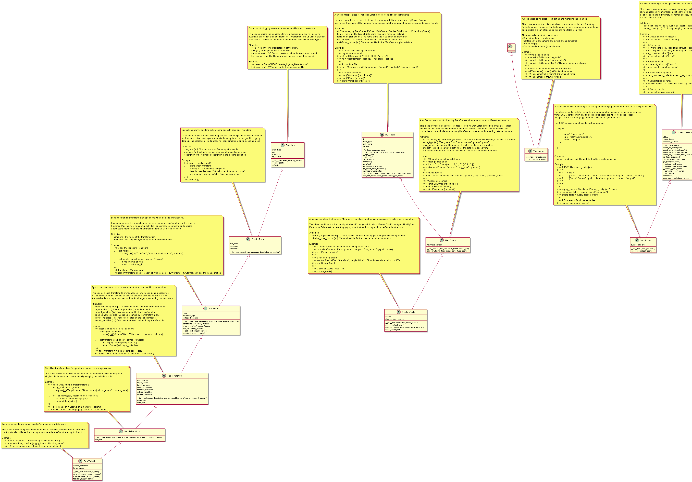

# Metaplus Transforms Framework

This program provides a data transformation framework for working with tables (DataFrames) in PySpark, Pandas, or Polars. It tracks all transformations and important events in a structured, auditable way using JSON logs.

## Main Components



### 1. MetaFrame
**Purpose:** Wraps a DataFrame and tracks its metadata.

**Features:**
- Supports loading tables from CSV, Parquet, or SAS files into Spark, Pandas, or Polars DataFrames.
- Can convert between DataFrame types (Pandas, Polars, PySpark).
- Stores table metadata including source path, table name, and frame type.
- Provides utility methods for DataFrame type conversion.

**Example:**
```python
from pyspark.sql import SparkSession
from metaframe import MetaFrame

spark = SparkSession.builder.getOrCreate()
tbl = MetaFrame.load(spark=spark, path="test.csv", format="csv", table_name="test_table", frame_type="pyspark")
```

### 2. PipelineTable
**Purpose:** Extends MetaFrame to include event tracking and logging capabilities.

**Features:**
- Inherits from MetaFrame and adds event tracking functionality.
- Stores a list of `PipelineEvent` objects describing actions performed on the table.
- Can save all events to a JSON log file.
- Automatically logs load events when tables are loaded.

**Example:**
```python
from pipeline_table import PipelineTable

tbl = PipelineTable.load(spark=spark, path="test.csv", format="csv", table_name="test_table", frame_type="pyspark")
```

### 3. PipelineEvent
**Purpose:** Represents an event (e.g., loading a table, applying a transform).

**Features:**
- Stores event type, message, description, timestamp, and a unique UUID.
- Can log itself as a JSON object to a file.
- Base class for all pipeline events.

**Example JSON output for a load event:**
```json
{
  "event_type": "load",
  "message": "Loaded table from test.csv as csv (pyspark)",
  "description": "Loaded test_table from test.csv",
  "uuid": "b2e7c8e2-7d4e-4c7e-8b8e-2f6e7c8e2d4e",
  "timestamp": "2025-08-10T12:34:56.789012",
  "log_location": "events_log/job_1/test_table_events.json"
}
```

### 4. Transform and Subclasses
**Purpose:** Encapsulate transformations (e.g., dropping a column).

**Features:**
- Each transform is a subclass of `PipelineEvent` and logs itself when applied.
- `Transform` is the base class for all transformations.
- `TableTransform` handles transformations that act on specific variables.
- `SimpleTransform` handles transformations that act on a single variable.
- Example: `DropVariable` removes a column from the DataFrame and logs the action.

**Example:**
```python
from transforms_class import DropVariable

tbl = DropVariable("age")(tbl)
```

**Example JSON output for a transform event:**
```json
{
  "event_type": "transform",
  "message": "DropVariable",
  "description": "Removes this variable from a dataframe",
  "uuid": "c3f9e8d2-1a2b-4c3d-9e8d-2c1a2b4c3d9e",
  "timestamp": "2025-08-10T12:35:01.123456",
  "log_location": "events_log/job_1/test_table_events.json",
  "name": "DropVariable",
  "created_variables": null,
  "renamed_variables": null,
  "deleted_variables": ["age"],
  "target_table": "test_table",
  "target_variable": "age"
}
```

### 5. FrameTypeVerifier
**Purpose:** Ensures the DataFrame matches the expected type (PySpark, Pandas, Polars).

---

## Example Workflow

1. **Load a table:**
    ```python
    from pyspark.sql import SparkSession
    from pipeline_table import PipelineTable
    
    spark = SparkSession.builder.master("local").appName("TransformTest").getOrCreate()
    tbl = PipelineTable.load(spark=spark, path="test.csv", format="csv", table_name="test_table", frame_type="pyspark")
    ```
    Automatically logs a "load" event.

2. **Apply a transformation:**
    ```python
    from transforms_class import DropVariable
    
    tbl = DropVariable("age")(tbl)
    ```
    Logs a "transform" event describing the column dropped.

3. **Save all events:**
    ```python
    tbl.save_events()
    ```
    Writes all events to a JSON file for auditing.

---

## Event Logging

- Events are saved in `events_log/job_1/{table_name}_events.json`.
- Each event is a JSON object, one per line.
- This provides a complete audit trail of all actions performed on each table.

---

## File Structure

- [`metaframe.py`](metaframe.py): MetaFrame class for DataFrame wrapping and type conversion
- [`pipeline_table.py`](pipeline_table.py): PipelineTable class that extends MetaFrame with event tracking
- [`pipeline_event.py`](pipeline_event.py): Event and PipelineEvent classes for logging
- [`transforms_class.py`](transforms_class.py): Transformation classes (Transform, TableTransform, SimpleTransform, DropVariable)
- [`test.py`](test.py): Example usage demonstrating the complete workflow

---

## Notes

- All transformations should inherit from `Transform` and implement the `transforms` method.
- The framework is designed for transparency and auditability in data pipelines by logging every important action as a structured JSON event.
- The `PipelineTable` class is the main entry point for users who want event tracking functionality.

---

## Summary

This framework makes your data pipeline transparent and auditable by logging every important action as a structured JSON event. You can trace exactly what happened to each table, when, and why. The `PipelineTable` class provides the main interface for loading tables and tracking transformations, while the `MetaFrame` class provides the underlying DataFrame management capabilities.